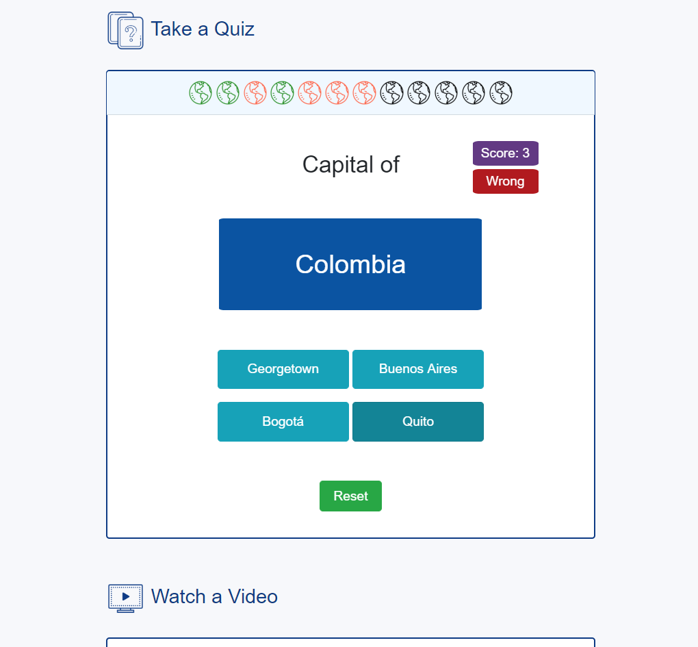
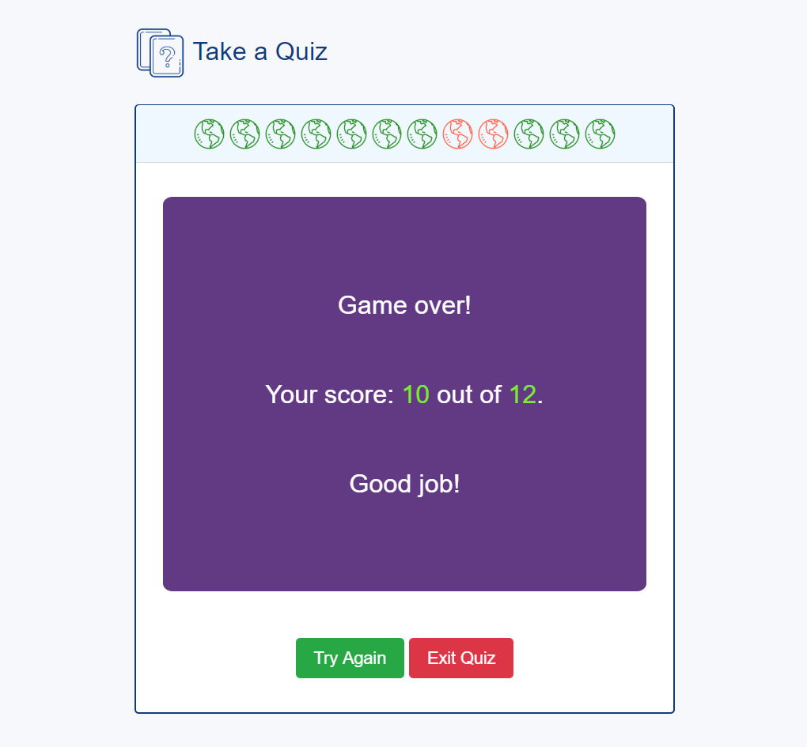

# OnlineSchool
Online school lesson with a quiz build with jQuery
<h4>Description</h4>
                            
The main purpose of the project was to build a responsive webpage of an online school - Lesson: South America. The webpage displays different sections of the online lsesson (photo gallery, text, quiz, video and research assignment) and demostrates the use of Bootsrap for responsive styling and jQuery for creating the quiz.
 
                            <h4>Developing Tools:</h4>
                            <ul>
                                <li>HTML5</li>
                                <li>CSS3</li>
                                <li>Bootstrap</li>
                                <li>jQuery</li>                   
                            </ul>
                            <h4>Features:</h4>
                            <ul>
                                <li>The webpage is styled with Bootstrap and includes  responsive elements as jumbotron, cards, video, carousel with the photo gallery, and etc.</li>
                                <li>The Quiz section adds interactivity for the webpage and is created with jQuery. The quiz has the following elements:
                                    <ul>
                                        <li> A country is displayed in a random order (1 out of 12).</li>
                                        <li>There are 4 answer choices with only 1 correct answer.</li>
                                        <li>If the correct answer is selected, the "right" label is shown for 1 sec (or the "wrong" label).</li>
                                        <li>12 displayed maps will be colored one at a time: green for the right answer and red for the wrong answer.</li>
                                        <li>The score window updates the number of correct answers.</li>                        
                                        <li>The player can reset the game at any time and start  a new quiz.</li>
                                        <li>The game includes music sounds (wrong, correct, gameover) for creating a playful mood.</li>
                                        <li>After 12 questions, the gameover window is displayed with the total score number and the achievement sentence.</li>
                                    </ul>                   
                                </li>
                                <li>Provided external links in the Research section make it convinient for the student to find information for the assignment.</li>
                            </ul>

